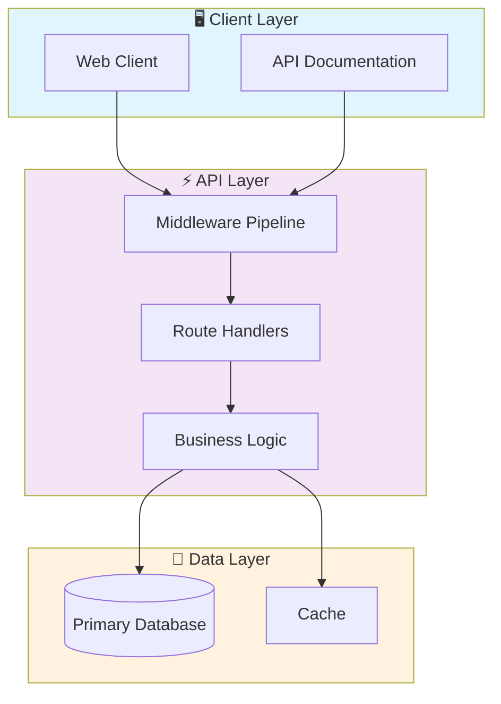
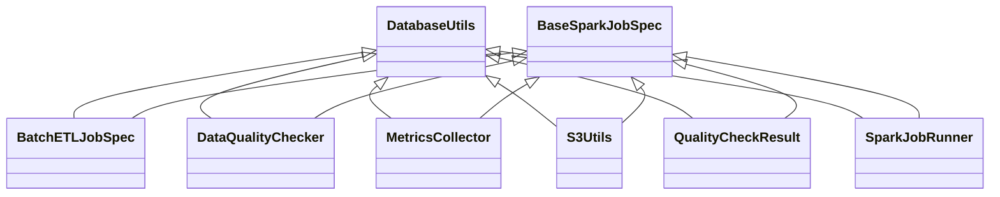

# 📊 Distributed Data Processing Pipeline

> Enterprise-grade distributed data processing pipeline with Apache Spark (Scala + Python), Delta Lake, and Airflow orchestration

[](https://img.shields.io/badge/)
[](https://img.shields.io/badge/)
[](https://img.shields.io/badge/)
[](https://img.shields.io/badge/)
[](https://img.shields.io/badge/)
[](https://img.shields.io/badge/)
[](LICENSE)

[English](#english) | [Português](#português)

---

## English

### 🎯 Overview

**Distributed Data Processing Pipeline** is a production-grade Python application complemented by Scala, Shell that showcases modern software engineering practices including clean architecture, comprehensive testing, containerized deployment, and CI/CD readiness.

The codebase comprises **4,707 lines** of source code organized across **28 modules**, following industry best practices for maintainability, scalability, and code quality.

### ✨ Key Features

- **🔄 Data Pipeline**: Scalable ETL with parallel processing
- **✅ Data Validation**: Schema validation and quality checks
- **📊 Monitoring**: Pipeline health metrics and alerting
- **🔧 Configurability**: YAML/JSON-based pipeline configuration
- **🏗️ Object-Oriented**: 11 core classes with clean architecture

### 🏗️ Architecture





### 🚀 Quick Start

#### Prerequisites

- Python 3.12+
- pip (Python package manager)
- Docker and Docker Compose (optional)

#### Installation

```bash
# Clone the repository
git clone https://github.com/galafis/distributed-data-processing-pipeline.git
cd distributed-data-processing-pipeline

# Create and activate virtual environment
python -m venv venv
source venv/bin/activate  # On Windows: venv\Scripts\activate

# Install dependencies
pip install -r requirements.txt
```

#### Running

```bash
# Run the application
python src/main.py
```

### 🐳 Docker

```bash
# Start all services
docker-compose up -d

# View logs
docker-compose logs -f

# Stop all services
docker-compose down

# Rebuild after changes
docker-compose up -d --build
```

### 🧪 Testing

```bash
# Run all tests
pytest

# Run with coverage report
pytest --cov --cov-report=html

# Run specific test module
pytest tests/test_main.py -v

# Run with detailed output
pytest -v --tb=short
```

### 📁 Project Structure

```
distributed-data-processing-pipeline/
├── config/        # Configuration
│   └── pipeline.yaml
├── dags/
│   └── data_pipeline_dag.py
├── data/
│   ├── processed/
│   ├── raw/
│   └── staging/
├── docker/
│   └── Dockerfile
├── notebooks/
├── scripts/
│   ├── generate_quality_report.py
│   ├── run_integration_tests.sh
│   ├── run_performance_tests.sh
│   └── validate_project.sh
├── src/          # Source code
│   ├── main/
│   │   ├── python/
│   │   └── scala/
│   └── test/         # Test suite
│       └── scala/
├── tests/         # Test suite
│   └── python/
│       ├── integration/
│       ├── unit/
│       └── __init__.py
├── AUDIT_FINAL_REPORT.md
├── AUDIT_SUMMARY.md
├── CONTRIBUTING.md
├── DOCUMENTATION.md
├── LICENSE
├── README.md
├── docker-compose.yml
└── requirements.txt
```

### 🛠️ Tech Stack

| Technology | Description | Role |
|------------|-------------|------|
| **Python** | Core Language | Primary |
| **Gin** | Go web framework | Framework |
| **NumPy** | Numerical computing | Framework |
| **Pandas** | Data manipulation library | Framework |
| **Prometheus** | Monitoring & alerting | Framework |
| **Apache Spark** | Distributed computing | Framework |
| Scala | 12 files | Supporting |
| Shell | 3 files | Supporting |

### 🚀 Deployment

#### Cloud Deployment Options

The application is containerized and ready for deployment on:

| Platform | Service | Notes |
|----------|---------|-------|
| **AWS** | ECS, EKS, EC2 | Full container support |
| **Google Cloud** | Cloud Run, GKE | Serverless option available |
| **Azure** | Container Instances, AKS | Enterprise integration |
| **DigitalOcean** | App Platform, Droplets | Cost-effective option |

```bash
# Production build
docker build -t distributed-data-processing-pipeline:latest .

# Tag for registry
docker tag distributed-data-processing-pipeline:latest registry.example.com/distributed-data-processing-pipeline:latest

# Push to registry
docker push registry.example.com/distributed-data-processing-pipeline:latest
```

### 🤝 Contributing

Contributions are welcome! Please feel free to submit a Pull Request. For major changes, please open an issue first to discuss what you would like to change.

1. Fork the project
2. Create your feature branch (`git checkout -b feature/AmazingFeature`)
3. Commit your changes (`git commit -m 'Add some AmazingFeature'`)
4. Push to the branch (`git push origin feature/AmazingFeature`)
5. Open a Pull Request

### 📄 License

This project is licensed under the MIT License - see the [LICENSE](LICENSE) file for details.

### 👤 Author

**Gabriel Demetrios Lafis**
- GitHub: [@galafis](https://github.com/galafis)
- LinkedIn: [Gabriel Demetrios Lafis](https://linkedin.com/in/gabriel-demetrios-lafis)

---

## Português

### 🎯 Visão Geral

**Distributed Data Processing Pipeline** é uma aplicação Python de nível profissional, complementada por Scala, Shell que demonstra práticas modernas de engenharia de software, incluindo arquitetura limpa, testes abrangentes, implantação containerizada e prontidão para CI/CD.

A base de código compreende **4,707 linhas** de código-fonte organizadas em **28 módulos**, seguindo as melhores práticas do setor para manutenibilidade, escalabilidade e qualidade de código.

### ✨ Funcionalidades Principais

- **🔄 Data Pipeline**: Scalable ETL with parallel processing
- **✅ Data Validation**: Schema validation and quality checks
- **📊 Monitoring**: Pipeline health metrics and alerting
- **🔧 Configurability**: YAML/JSON-based pipeline configuration
- **🏗️ Object-Oriented**: 11 core classes with clean architecture

### 🏗️ Arquitetura


### 🚀 Início Rápido

#### Prerequisites

- Python 3.12+
- pip (Python package manager)
- Docker and Docker Compose (optional)

#### Installation

```bash
# Clone the repository
git clone https://github.com/galafis/distributed-data-processing-pipeline.git
cd distributed-data-processing-pipeline

# Create and activate virtual environment
python -m venv venv
source venv/bin/activate  # On Windows: venv\Scripts\activate

# Install dependencies
pip install -r requirements.txt
```

#### Running

```bash
# Run the application
python src/main.py
```

### 🐳 Docker

```bash
# Start all services
docker-compose up -d

# View logs
docker-compose logs -f

# Stop all services
docker-compose down

# Rebuild after changes
docker-compose up -d --build
```

### 🧪 Testing

```bash
# Run all tests
pytest

# Run with coverage report
pytest --cov --cov-report=html

# Run specific test module
pytest tests/test_main.py -v

# Run with detailed output
pytest -v --tb=short
```

### 📁 Estrutura do Projeto

```
distributed-data-processing-pipeline/
├── config/        # Configuration
│   └── pipeline.yaml
├── dags/
│   └── data_pipeline_dag.py
├── data/
│   ├── processed/
│   ├── raw/
│   └── staging/
├── docker/
│   └── Dockerfile
├── notebooks/
├── scripts/
│   ├── generate_quality_report.py
│   ├── run_integration_tests.sh
│   ├── run_performance_tests.sh
│   └── validate_project.sh
├── src/          # Source code
│   ├── main/
│   │   ├── python/
│   │   └── scala/
│   └── test/         # Test suite
│       └── scala/
├── tests/         # Test suite
│   └── python/
│       ├── integration/
│       ├── unit/
│       └── __init__.py
├── AUDIT_FINAL_REPORT.md
├── AUDIT_SUMMARY.md
├── CONTRIBUTING.md
├── DOCUMENTATION.md
├── LICENSE
├── README.md
├── docker-compose.yml
└── requirements.txt
```

### 🛠️ Stack Tecnológica

| Tecnologia | Descrição | Papel |
|------------|-----------|-------|
| **Python** | Core Language | Primary |
| **Gin** | Go web framework | Framework |
| **NumPy** | Numerical computing | Framework |
| **Pandas** | Data manipulation library | Framework |
| **Prometheus** | Monitoring & alerting | Framework |
| **Apache Spark** | Distributed computing | Framework |
| Scala | 12 files | Supporting |
| Shell | 3 files | Supporting |

### 🚀 Deployment

#### Cloud Deployment Options

The application is containerized and ready for deployment on:

| Platform | Service | Notes |
|----------|---------|-------|
| **AWS** | ECS, EKS, EC2 | Full container support |
| **Google Cloud** | Cloud Run, GKE | Serverless option available |
| **Azure** | Container Instances, AKS | Enterprise integration |
| **DigitalOcean** | App Platform, Droplets | Cost-effective option |

```bash
# Production build
docker build -t distributed-data-processing-pipeline:latest .

# Tag for registry
docker tag distributed-data-processing-pipeline:latest registry.example.com/distributed-data-processing-pipeline:latest

# Push to registry
docker push registry.example.com/distributed-data-processing-pipeline:latest
```

### 🤝 Contribuindo

Contribuições são bem-vindas! Sinta-se à vontade para enviar um Pull Request.

### 📄 Licença

Este projeto está licenciado sob a Licença MIT - veja o arquivo [LICENSE](LICENSE) para detalhes.

### 👤 Autor

**Gabriel Demetrios Lafis**
- GitHub: [@galafis](https://github.com/galafis)
- LinkedIn: [Gabriel Demetrios Lafis](https://linkedin.com/in/gabriel-demetrios-lafis)
